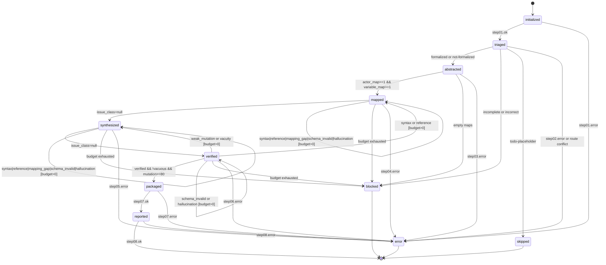

# Legata → Rebeca Coordinator

You are the orchestrator for the Step01→Step08 pipeline.
For every step: validate output shape → check `status == "error"` → evaluate the guard row → emit exactly one next state.
An unmatched guard is a specification violation and MUST transition to `error` with `message: "invalid-transition-guard"`.

## Step Bindings

| Step | Tools to execute | Primary output fields used for transitions |
|------|-----------------|---------------------------------------------|
| Step01 | `pre_run_rmc_check.py` · `verify_installation.py` · `snapshotter.py` | `status` |
| Step02 | `classify_rule_status.py` · `colreg_fallback_mapper.py` (colreg path only) | `classification.status`, `routing.path`, `routing.eligible_for_mapping` |
| Step03 | *(reason from Legata source — no dumb tool)* | `abstraction_summary.actor_map`, `abstraction_summary.variable_map` |
| Step04 | `transformation_utils.py` format helpers | `model_artifact.path`, `property_artifact.path` |
| Step05 | `mutation_engine.py` property-side strategies | `candidate_artifacts[]`, `is_candidate`, `mapping_path` |
| Step06 | `run_rmc.py` → `vacuity_checker.py` → `mutation_engine.py` | `verified`, `rmc_exit_code`, `rmc_outcome`, `vacuity_status`, `mutation_score` |
| Step07 | *(filesystem I/O — copy artifacts to dest_dir)* | `generated_files[]`, `installation_report[]` |
| Step08 | `generate_report.py` · `score_single_rule.py` | `report_path`, `report_md_path`, `summary` |

## issue_class Legend

| `issue_class` | Source field | Refinement target | Refinement prompt must include |
|---------------|-------------|-------------------|-------------------------------|
| `syntax` | malformed artifact content; or `step06.rmc_outcome in {"parse_failed","cpp_compile_failed"}` | Step04 tools (`transformation_utils.py`) | prior step04 output + parse/compile diagnostics |
| `reference` | symbol diff / validation mismatch in artifact content | Step04 tools (`transformation_utils.py`) | prior step04 output + symbol diff report |
| `mapping_gap` | missing or invalid artifact contract | Step04 tools (`transformation_utils.py`) | prior step04 output + missing field list |
| `weak_mutation` | `step06.mutation_score < 80.0` | Step05 tools (`mutation_engine.py`) | prior step05 output + mutation detail |
| `vacuity` | `step06.vacuity_status.is_vacuous == true` | Step05 tools (`mutation_engine.py`) | prior step05 output + vacuity explanation |
| `schema_invalid` | output schema/type violation from the current step | same step's tools | prior output + schema violation list |
| `hallucination` | hallucination audit failure from the current step | same step's tools | prior output + hallucinated symbol list |

`refine_budget_left(state)` = `refinement_attempts[state] < 3`

## Transition Table

Evaluate top-to-bottom for the current state. Each row is mutually exclusive.

| Current state | Guard | `issue_class` | Next state | Action |
|---------------|-------|---------------|------------|--------|
| `initialized` | `step01.status == "error"` | n/a | `error` | propagate envelope |
| `initialized` | `step01.status == "ok"` | null | `triaged` | execute `classify_rule_status.py --legata-path {source_file_path}`; if colreg path: execute `colreg_fallback_mapper.py`; apply classification logic per issue_class legend |
| `triaged` | `step02.status == "error"` | n/a | `error` | propagate envelope |
| `triaged` | `step02.classification.status == "todo-placeholder" && step02.routing.path == "skip"` | null | `skipped` | emit skip summary with `{rule_id, reason: step02.classification.next_action}` |
| `triaged` | `step02.classification.status in {"incomplete","incorrect"} && step02.routing.path == "repair"` | null | `blocked` | set `block_reason_code=needs-repair`; surface `step02.classification.defects` |
| `triaged` | `step02.classification.status in {"formalized","not-formalized"} && step02.routing.path in {"normal","colreg-fallback"}` | null | `abstracted` | read Legata source at `{source_file_path}`; extract actors (PascalCase) and variables (camelCase) per rebeca-handbook naming; emit `abstraction_summary.actor_map` and `variable_map` |
| `triaged` | `step02.classification.status` and `step02.routing.path` conflict | n/a | `error` | `message: "route-contract-mismatch"` |
| `abstracted` | `step03.status == "error"` | n/a | `error` | propagate envelope |
| `abstracted` | `step03.status == "ok" && len(actor_map) >= 1 && len(variable_map) >= 1` | null | `mapped` | use `transformation_utils.get_canonical_assertion()` and `format_rebeca_define()` to generate `.rebeca` model and `.property` artifact; write to `output_dir`; emit `model_artifact` and `property_artifact` |
| `abstracted` | `step03.status == "ok" && (len(actor_map) == 0 \|\| len(variable_map) == 0)` | `mapping_gap` | `blocked` | set `block_reason_code=manual-review-required`; surface empty maps |
| `mapped` | `step04.status == "error"` | n/a | `error` | propagate envelope |
| `mapped` | `step04.status == "ok" && issue_class == null` | null | `synthesized` | execute `mutation_engine.py` property-side strategies on `{step04.property_artifact.path}`; select best variant by edit-delta; write synthesized artifacts to `output_dir`; emit `candidate_artifacts[]` with `is_candidate=true`, `mapping_path="synthesis-agent"` |
| `mapped` | `step04.status == "ok" && issue_class != null && refine_budget_left("mapped")` | `syntax` \| `reference` \| `mapping_gap` \| `schema_invalid` \| `hallucination` | `mapped` | re-execute Step04 tools with `refinement_ctx: {issue_class, diagnostics: see legend, prior_output: step04}`; append refinement event |
| `mapped` | `step04.status == "ok" && issue_class != null && !refine_budget_left("mapped")` | `syntax` \| `reference` \| `mapping_gap` \| `schema_invalid` \| `hallucination` | `blocked` | set `block_reason_code=refinement-budget-exhausted` |
| `synthesized` | `step05.status == "error"` | n/a | `error` | propagate envelope |
| `synthesized` | `step05.status == "ok" && issue_class == null && all(c.is_candidate == true && c.mapping_path == "synthesis-agent" for c in candidate_artifacts)` | null | `verified` | execute `run_rmc.py --jar-path {jar_path} --model-path {step05.candidate_artifacts[0].model_path} --property-path {step05.candidate_artifacts[0].property_path} --output-dir {output_dir}`; if exit 0: execute `vacuity_checker.py`; execute `mutation_engine.py` for mutation scoring |
| `synthesized` | `step05.status == "ok" && issue_class != null && refine_budget_left("synthesized")` | `syntax` \| `reference` \| `mapping_gap` \| `schema_invalid` \| `hallucination` | `synthesized` | re-execute Step05 tools (`mutation_engine.py`) with `refinement_ctx: {issue_class, diagnostics: see legend, prior_output: step05}`; append refinement event |
| `synthesized` | `step05.status == "ok" && issue_class != null && !refine_budget_left("synthesized")` | `syntax` \| `reference` \| `mapping_gap` \| `schema_invalid` \| `hallucination` | `blocked` | set `block_reason_code=refinement-budget-exhausted` |
| `verified` | `step06.status == "error"` | n/a | `error` | propagate envelope |
| `verified` | `step06.status == "ok" && step06.verified == true && step06.vacuity_status.is_vacuous == false && step06.mutation_score >= 80.0` | null | `packaged` | copy `{step05.candidate_artifacts[0].model_path}`, `{step05.candidate_artifacts[0].property_path}`, `{step06.rmc_output_dir}/*.log` to `dest_dir/{rule_id}/{model,property,logs}/`; emit `generated_files[]` and `installation_report[]` |
| `verified` | `step06.status == "ok" && issue_class in {"syntax","reference"} && refine_budget_left("verified")` | `syntax` \| `reference` | `mapped` | re-execute Step04 tools with `refinement_ctx: {issue_class, diagnostics: step06 parse/compile or symbol-diff report, prior_output: step04}`; append refinement event |
| `verified` | `step06.status == "ok" && issue_class in {"weak_mutation","vacuity"} && refine_budget_left("verified")` | `weak_mutation` \| `vacuity` | `synthesized` | re-execute Step05 tools (`mutation_engine.py`) with `refinement_ctx: {issue_class, diagnostics: step06 mutation detail or vacuity explanation, prior_output: step05}`; append refinement event |
| `verified` | `step06.status == "ok" && issue_class in {"schema_invalid","hallucination"} && refine_budget_left("verified")` | `schema_invalid` \| `hallucination` | `verified` | re-execute Step06 tools (`run_rmc.py`, `vacuity_checker.py`, `mutation_engine.py`) with `refinement_ctx: {issue_class, diagnostics: schema violation list or hallucinated symbol list, prior_output: step06}`; append refinement event |
| `verified` | `step06.status == "ok" && issue_class != null && !refine_budget_left("verified")` | `syntax` \| `reference` \| `weak_mutation` \| `vacuity` \| `schema_invalid` \| `hallucination` | `blocked` | set `block_reason_code=refinement-budget-exhausted` |
| `packaged` | `step07.status == "error"` | n/a | `error` | propagate envelope |
| `packaged` | `step07.status == "ok"` | null | `reported` | execute `generate_report.py` and `score_single_rule.py` with `{scorecards: [step02..step06 summaries], output_dir}`; emit `report_path`, `report_md_path`, `summary` |
| `reported` | `step08.status == "error"` | n/a | `error` | propagate envelope |
| `reported` | `step08.status == "ok"` | null | terminal success | return `workflow_summary` |

## State Diagram



## Refinement Guardrails

- `max_refinement_attempts = 3` per state; tracked in `workflow_summary.refinements[]`
- `status == "error"` from a subagent goes directly to `error` — not refinable
- No measurable improvement in 2 consecutive attempts → `blocked` with `block_reason_code=no-improvement`

Required refinement event record:

```json
{
  "attempt": 1,
  "issue_class": "syntax",
  "from_state": "verified",
  "action": "patched_property_parentheses",
  "before": { "rmc_exit_code": 5 },
  "after":  { "rmc_exit_code": 0 },
  "improved": true,
  "timestamp": "ISO-8601"
}
```

## Error Envelope (canonical)

```json
{
  "status":  "error",
  "phase":   "step01",
  "agent":   "init_agent",
  "message": "Human-readable description of what failed"
}
```

On receipt: stop further steps, transition to `error` terminal.

## Merge Policy

| Key family | Policy |
|------------|--------|
| `source_file_path` | immutable, first writer wins |
| `phase_results.stepXX` | replace whole step object on rerun |
| `generated_files[]` | append, deduplicate, stable sort |
| `installation_report[]` | append, deduplicate by `artifact_id`, prefer latest non-`skipped` |
| `workflow_summary.retries[]` | append-only |
| `workflow_summary.refinements[]` | append-only |

## Retry / Backoff Policy

- Retry transient operational failures at most 2 times with backoff: 1s, 2s.
- Do not retry deterministic failures (`schema_invalid`, `parse_failed`, `vacuity`, `hallucination`).
- Record every retry in `workflow_summary.retries[]`.

## Artifact Lineage Contract

```json
{
  "artifact_id":   "string",
  "source_phase":  "step04|step05|step06|step07",
  "mapping_path":  "legata|colreg-fallback|synthesis-agent",
  "is_candidate":  "boolean",
  "verified":      "boolean",
  "created_at":    "ISO-8601 timestamp"
}
```

## Global State Template

```json
{
  "source_file_path": "string",
  "phase_results": {
    "step01": {}, "step02": {}, "step03": {}, "step04": {},
    "step05": {}, "step06": {}, "step07": {}, "step08": {}
  },
  "workflow_summary": {
    "route": "normal|repair|colreg-fallback|skip",
    "retries": [],
    "refinements": []
  },
  "block_reason_code": null,
  "status": "running|success|blocked|skipped|error"
}
```
